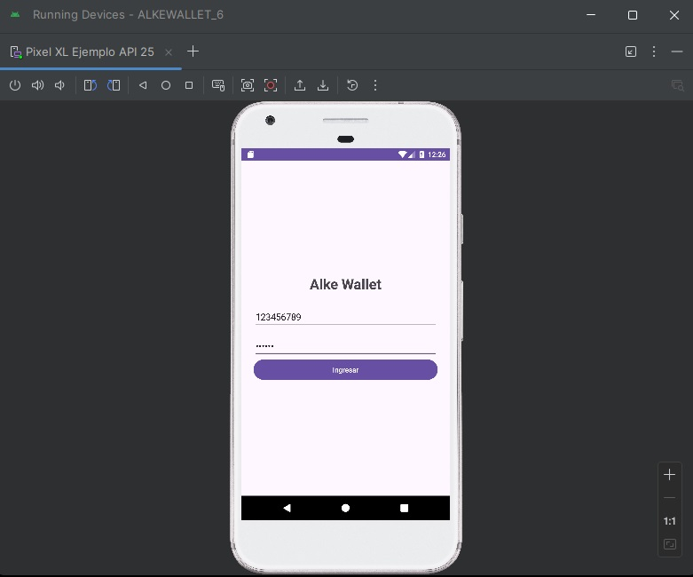
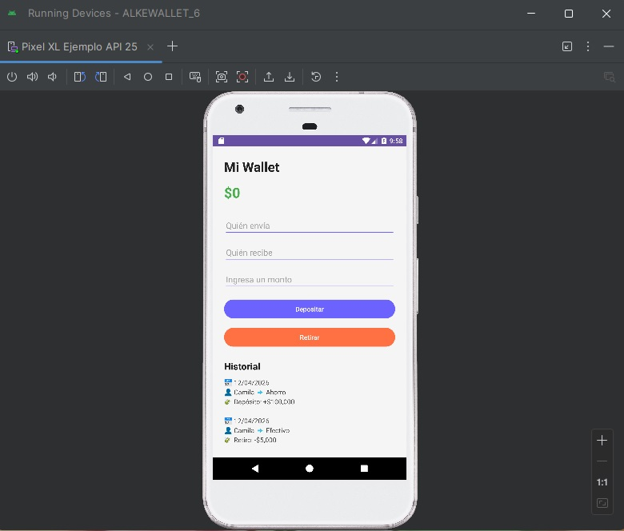
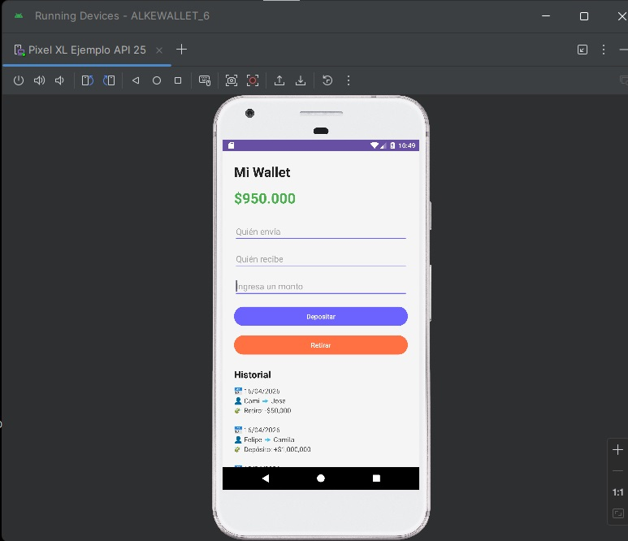
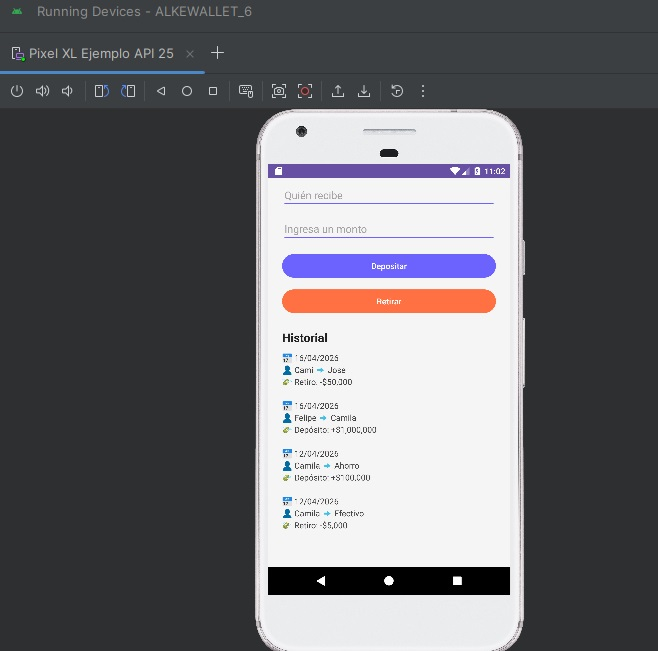

# 💸 ALKEWALLET 6

Aplicación móvil desarrollada en Android Studio como continuación del proyecto del módulo 5.

---

## 📱 Descripción

ALKEWALLET 6 es una aplicación de billetera virtual que permite a los usuarios iniciar sesión, visualizar su saldo, realizar depósitos y retiros, y consultar un historial de transacciones.

Este proyecto corresponde a la evolución del sistema desarrollado en el Módulo 5, incorporando mejoras del Módulo 6, principalmente el consumo de servicios API REST mediante Retrofit y el uso de datos dinámicos.

---

## 🧩 Continuidad del Proyecto

El presente proyecto se basa en una aplicación previamente funcional desarrollada en el Módulo 5.

En esta etapa, se decidió mantener la estructura existente y enfocarse en la integración de nuevas funcionalidades sin alterar la estabilidad del sistema.

Las mejoras implementadas incluyen:

- 🌐 Integración de API REST
- 🎨 Mejora visual de la interfaz
- 🧠 Organización de la lógica mediante ViewModel

---

## 🚀 Funcionalidades

- Inicio de sesión (login)
- Visualización de saldo
- Depósitos de dinero
- Retiros de dinero
- Historial de transacciones
- Validación de datos ingresados
- Consumo de API REST (MockAPI)

---

## 🛠️ Tecnologías y herramientas utilizadas

- **Lenguaje:** Kotlin  
- **IDE:** Android Studio  
- **Arquitectura:** MVVM (ViewModel)  
- **Consumo de API:** Retrofit  
- **Simulación de backend:** MockAPI  
- **Diseño UI:** XML  
- **Depuración:** Logcat  

---

## 🌐 API utilizada

La aplicación consume datos desde un endpoint creado en MockAPI:

https://69dc1297560857310a0838b1.mockapi.io/transactions

Los datos obtenidos incluyen:

- Fecha (`date`)
- Monto (`amount`)
- Descripción (`description`)
- Remitente (`from`)
- Destinatario (`to`)

---

## 📂 Estructura del proyecto

- `ui.login` → Pantalla de inicio de sesión  
- `ui.wallet` → Pantalla principal de la billetera  
- `viewmodel` → Lógica de negocio  
- `data.api` → Cliente Retrofit y servicio API  
- `model` → Modelo de datos  

---

## 💾 Persistencia de datos (Room)

La implementación de Room fue considerada como parte de las mejoras del proyecto. Sin embargo, no se integró en esta versión debido a problemas de compatibilidad con Gradle durante el desarrollo.

Además, dado que la aplicación trabaja con datos obtenidos desde una API REST en tiempo real, la persistencia local no era estrictamente necesaria para cumplir con los objetivos del módulo.

Se priorizó la estabilidad y funcionamiento completo de la aplicación.

---

## 📸 Capturas de pantalla

  
 

---

## ⚠️ Consideraciones

- La aplicación fue desarrollada con enfoque en funcionalidad y estabilidad.
- Se priorizó evitar errores en la ejecución sobre la implementación de características adicionales.
- Room queda como mejora futura del proyecto.

---

## 📚 Bibliografía

### 📘 Material del curso

- Manual Módulo 6: Desarrollo de Aplicaciones Android  
- Contenidos sobre:
  - API REST
  - Testing
  - Acceso a datos
  - Distribución de aplicaciones móviles  

---

### 🌐 Recursos externos

- Android Developers. (2024). *Guide to app architecture*.  
  https://developer.android.com/topic/architecture  

- Android Developers. (2024). *Build your first app*.  
  https://developer.android.com/training/basics/firstapp  

- Square. (2024). *Retrofit Documentation*.  
  https://square.github.io/retrofit/  

- MockAPI. (2024).  
  https://mockapi.io  

---

## 👩‍💻 Autora

**Camila Torres Reyes**
